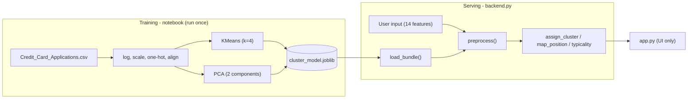

# Backend Design — Credit Cat

**Doc:** 2 of 3 · **Version:** 0.2 · **Owners:** Emmet, Prithvi
**Implements:** FR-1, FR-6, FR-8, FR-9, FR-11 and NFR-2..NFR-6.

---

## 1. Responsibilities
All model/data logic, **no UI** (NFR-4). Train + save the artifact (notebook); load it once;
turn a raw applicant into a segment, map position, and typicality reading via the *same*
preprocessing as training (NFR-3). The frontend calls only the public functions below.

> Note: segment **display names** and credit-segment copy (limit ranges, card types,
> "what matters") live in `app.py`'s `CONTENT` dict — that is presentation, not model logic.

## 2. Data flow


## 3. Artifact contract — `models/cluster_model.joblib`
`dict` with: `kmeans`, `scaler`, `binary_cols`/`categorical_cols`/`continuous_cols`/`log_cols`,
`feature_columns` (38), `cluster_names`, `cluster_profiles`, `approval_rates`, `friendly`,
`pca`, `train_pca_coords` (N×2), `train_labels` (N), `cluster_distances` (per-cluster sorted
member→centroid distances).

## 4. Public API — `backend.py`
| Function | In | Out |
|---|---|---|
| `load_bundle(path)` | path | dict (cached) |
| `defaults()` | – | typical applicant dict |
| `category_options()` | – | valid values per categorical |
| `friendly_labels()` | – | inferred labels dict |
| `preprocess(raw)` | dict | 1×38 aligned row (single source of truth) |
| `assign_cluster(raw)` | dict | segment id |
| `get_cluster_info(cid)` | id | `{name, profile, approval_rate}` |
| `map_position(raw)` | dict | `(x, y)` PCA coords |
| `get_training_map()` | – | `(coords, labels)` |
| `typicality(raw)` | dict | `{cluster, percentile, label, nearest_other, nearest_other_name}` |
| `list_examples()` | – | representative applicant per segment |
| `random_applicant()` | – | a real row, sans ID/Class |

`typicality`: distance to own centroid → percentile vs `cluster_distances[cid]`;
label central (<.33) / typical (<.66) / on-the-edge; nearest other centroid surfaced when on-the-edge (RAI-5).

## 5. Reproducibility — fixed `random_state=42`; deterministic `preprocess`; pinned deps; sklearn train/load versions should match.
## 6. Robustness — only known feature keys used; missing → dataset default; unseen one-hot category → `fill_value=0`; failures surfaced, not crashed.
## 7. Privacy — input in-memory only; runtime reads the artifact (+ CSV for examples); writes only the artifact during training.
## 8. Testing — `assign_cluster` reproduces batch labels ≥97%; each example lands in its own segment; `map_position` finite; `typicality` percentile in [0,1].

## 9. Repo layout
```
credit-cat/
├── data/Credit_Card_Applications.csv
├── models/cluster_model.joblib
├── notebooks/Clustering_Story.ipynb
├── backend.py
├── app.py
├── requirements.txt
├── .streamlit/config.toml
├── docs/{system-requirements,backend,frontend}.md
├── CHANGELOG.md
└── README.md
```
