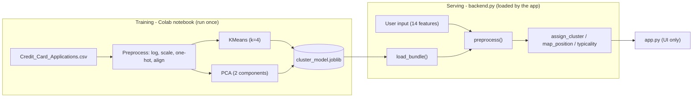

# Backend Design — Find Your Cluster

**Project:** Find Your Cluster (Datathon Pillar 2 · USML)
**Doc:** 2 of 3 (System Requirements → **Backend** → Frontend)
**Version:** 0.1 · **Owners:** Emmet, Prithvi
**Implements:** FR-1, FR-6, FR-8, FR-9, FR-10 and NFR-2, NFR-3, NFR-4, NFR-5, NFR-6 from the System Requirements.

---

## 1. Responsibilities

The backend is everything that turns data and user input into answers, with **no UI code**:

- Train the model and produce the saved artifact (in the notebook).
- Load that artifact once at runtime.
- Convert a raw applicant into a cluster, a map position, and a typicality reading,
  using the *same* preprocessing as training (NFR-3, single source of truth).
- Expose a small, clean set of functions the frontend calls. The frontend never
  touches a model, a scaler, or a DataFrame directly — it only calls these functions.

This satisfies **NFR-4 (separation of concerns):** all logic lives in `backend.py`;
`app.py` is presentation only.

## 2. Architecture & data flow



Two pipelines, one preprocessing recipe shared between them.

## 3. The artifact contract — `models/cluster_model.joblib`

A single `dict` saved with `joblib`. The backend depends on these exact keys:

| Key | Type | Purpose |
|---|---|---|
| `kmeans` | fitted KMeans | cluster assignment + centroids |
| `scaler` | fitted StandardScaler | scale continuous features |
| `binary_cols` / `categorical_cols` / `continuous_cols` / `log_cols` | list[str] | how each feature is handled |
| `feature_columns` | list[str] | the exact 38-column training layout for alignment |
| `cluster_names` | dict[int,str] | display names per cluster |
| `cluster_profiles` | dict[int,dict] | per-cluster median (original units) for the comparison |
| `approval_rates` | dict[int,float] | per-cluster historical approval rate |
| `pca` | fitted PCA(2) | transform a user to map coordinates (FR-8) |
| `train_pca_coords` | ndarray (N,2) | background points for the "You are here" map (FR-8) |
| `train_labels` | ndarray (N,) | cluster of each background point (FR-8) |
| `cluster_distances` | dict[int, ndarray] | sorted member-to-centroid distances per cluster, for typicality percentile (FR-9) |

> **Status:** the current bundle has the first 8 rows. The last 4 (`pca`,
> `train_pca_coords`, `train_labels`, `cluster_distances`) must be added to the
> notebook save step before FR-8 / FR-9 can be built.

## 4. Public API — `backend.py`

The only surface the frontend uses. Signatures are the contract:

| Function | Input | Output | Notes |
|---|---|---|---|
| `load_bundle(path)` | path str | dict | cached; called once |
| `preprocess(raw)` | dict of 14 features | DataFrame (1x38) | **internal, single source of truth**; log, scale, one-hot, align |
| `assign_cluster(raw)` | dict | int (cluster id) | uses `preprocess` then `kmeans.predict` |
| `get_cluster_info(cid)` | int | dict `{name, profile, approval_rate}` | for FR-7, FR-10 |
| `map_position(raw)` | dict | tuple `(x, y)` | user's PCA coordinates (FR-8) |
| `get_training_map()` | – | tuple `(coords, labels)` | background scatter (FR-8) |
| `typicality(raw)` | dict | dict `{percentile, label, nearest_other, nearest_other_name}` | FR-9 |
| `list_examples()` | – | dict[int, dict] | representative applicant per cluster (FR-4) |
| `random_applicant()` | – | dict | a real row, sans ID/Class (FR-5) |

### `typicality()` logic (FR-9)

1. Distance from the user to **their own** centroid = `kmeans.transform(x)[0][cid]`.
2. `percentile` = fraction of that cluster's members with a smaller distance
   (using `cluster_distances[cid]`).
3. `label`: `< 0.33` -> "very central", `0.33-0.66` -> "typical", `> 0.66` -> "on the edge".
4. `nearest_other` = the non-own centroid with the smallest distance; surfaced only
   when the user is on the edge, framed per **RAI-5** as orientation ("you sit between
   X and Y"), never as steps to change an outcome.

## 5. Reproducibility (NFR-2)

- All randomized steps fix `random_state=42` (KMeans, PCA, sampling).
- `preprocess()` is deterministic: same input -> same 38-column row -> same cluster.
- Versions pinned in `requirements.txt`; the scikit-learn version that *trained* the
  bundle should match the one that *loads* it (pin if a version warning appears).

## 6. Input validation & robustness (NFR-6)

- `preprocess()` accepts only the 14 known feature keys; missing keys fall back to the
  dataset default for that feature, extras are ignored.
- One-hot of an unseen category produces no matching column; `reindex(..., fill_value=0)`
  handles it safely (that category contributes zero, never a crash).
- Numeric inputs are clamped to the documented ranges before processing.
- Any load/predict failure raises a clear message; the app shows it rather than crashing.

## 7. Privacy (NFR-5, RAI-4)

- User input exists only in memory for the duration of one request and is never written
  to disk, logged, or sent over a network.
- The only file the backend reads at runtime is the local artifact (and the CSV for
  examples). The only file written is the artifact, and only during training.

## 8. Testing (no UI required)

A standalone check (`tests/` or a notebook cell) asserting:

- `assign_cluster` reproduces the batch training labels for >= 97% of rows
  (~98% expected; the rest are genuine boundary cases).
- Each `list_examples()[cid]` assigns back to cluster `cid`.
- `map_position()` returns two finite floats.
- `typicality()` returns a percentile in [0, 1] and a valid nearest-other id.

## 9. Repo layout

```
find-your-cluster/
├── data/Credit_Card_Applications.csv
├── models/cluster_model.joblib
├── notebooks/find_your_cluster.ipynb     # training pipeline (produces the artifact)
├── backend.py                            # all logic (this doc)
├── app.py                                # UI only (frontend doc)
├── requirements.txt
├── docs/
│   ├── system-requirements.md
│   ├── backend.md
│   └── frontend.md
└── README.md
```
